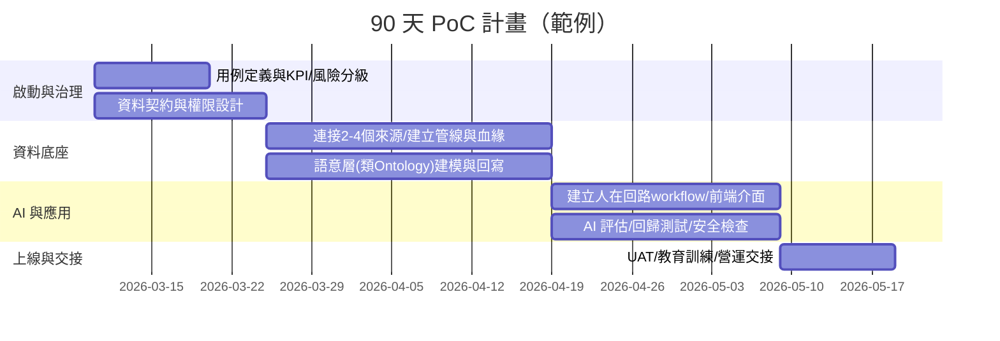

# 企業如何將 AI 導入內部與 Palantir 落地深度研究報告

## 執行摘要

多數企業把 AI 導入內部的「成功路徑」高度相似：先以可衡量、能快速產生營運價值的用例作為切入點（PoC），再擴大到跨部門流程（Pilot），最後進入可長期營運、可稽核、可控成本與風險的生產化體系（Production）。在這個過程中，真正決定成敗的往往不是模型本身，而是資料整合與治理、權限與稽核、評估與監控、以及組織協作機制（治理與責任歸屬）。這類「可信任 AI」的治理框架，可對應到 entity["organization","National Institute of Standards and Technology","us standards agency"] 的 AI RMF（含 Generative AI Profile）與 entity["organization","International Organization for Standardization","standards body"] 的 ISO/IEC 42001（AI 管理系統）等國際方法論，提供從風險識別、控制到持續改善的管理骨架。citeturn19search0turn19search2turn19search3

在「讓 AI 真正落地到營運」這個主題上，Palantir 的定位不是單一模型供應商，而更接近「資料 × 決策 × 流程」的作業系統：其在 entity["organization","U.S. Securities and Exchange Commission","us securities regulator"] 的 Form 10‑K 中，明確描述四個主要平台（Gotham、Foundry、Apollo、AIP），並強調以 Ontology 作為把資料、邏輯與行動串成決策架構的核心，且能在雲端、地端與更嚴苛環境中部署與持續交付。citeturn8view1turn8view2turn8view0

從四個具體客戶案例可看到其落地形態與成效指標的「可操作性」：  
1) entity["company","General Mills","food manufacturer"] 的 AIPCon Impact Study 指出其以 Ontology 整合 200 張主資料與營運表，建立即時端到端物流決策系統，並達到「每日約 4 萬美元、年化約 1,400 萬美元」節省，且超過 70% 推薦被人在回路接受。citeturn17view0turn18view0  
2) entity["company","Aramark","hospitality services"] 的 Impact Study 描述以 AIP+Foundry 在約 9 個月完成基礎資料集與用例推進，並以 LLM 做產品匹配，在 30% 初始匹配達到 99% 信心水準，且對分類工作做到「1% 人工補正、99% 自動化」。citeturn17view1turn18view1  
3) entity["company","Lowe's Companies, Inc.","home improvement retailer"] 的公開分享提到以 Foundry 建 Ontology 與 PoC 後，將「逾期活動」降低 75%，並在少於 4 個月從 PoC 走到 Production，且約 1,000 人同時在平台上工作。citeturn15search4  
4) entity["company","WesTrac","caterpillar dealer Australia"] 與 Palantir 的合作公告指出 Foundry 作為其「核心營運的數位孿生」，以零件約束與工單推進的可視化與建議提升效率，並預期未來五年整體吞吐量至少提升 5%。citeturn14search2  

同時，Palantir 的落地也存在典型風險：供應商鎖定（工具鏈深度整合後退出成本高）、高度敏感資料的隱私與監管風險，以及對第三方模型供應依賴帶來的政策/供應鏈不確定性（例如國防場景對特定模型供應的中斷風險）。citeturn3news52turn0news48

## 研究設計與內部連接器檢索結果

**必須回答的關鍵問題（資訊需求 4–6 題）**  
一、Palantir 的核心價值主張是什麼？它相對一般 AI 平台/資料平台的差異在哪（尤其是 Ontology 與「決策閉環」）？citeturn8view1turn3search5turn9search2  
二、Gotham / Foundry / Apollo / AIP 的核心模組與技術核心是什麼（資料整合、Pipeline、Ontology、Access Control、Apps、Evals/Agents）？citeturn8view1turn0search0turn5search4turn4search8turn0search1  
三、Palantir 如何在企業內部落地：PoC→Pilot→Production 的實務流程、時間尺度、所需角色/技能？citeturn11search2turn9search5turn12search1  
四、部署模式有哪些（雲/混合/本地/受管制環境）？Apollo 如何支撐多環境持續交付與變更治理？citeturn8view2turn4search4turn4search3turn4search8  
五、商業模式與定價結構如何呈現（訂閱/託管 vs on‑prem、O&M、專業服務）？以 SEC filing 為主怎麼讀？citeturn2search1turn8view0  
六、有哪些可驗證的客戶成效指標（至少 4 家、含量化）？citeturn18view0turn18view1turn15search4turn14search2  

**在三個連接器使用的實際搜尋查詢（短查詢提高命中率）**  
Slack：`Palantir`、`PLTR`、`Foundry`、`Gotham`、`AIP`、`Foundry Palantir`  
Gmail：`Palantir`、`(Palantir OR PLTR OR Foundry OR Gotham OR "Artificial Intelligence Platform" OR AIP)`  
Google Drive：`Palantir`、`Foundry Palantir`、`Gotham Palantir`、`Palantir ontology`

**連接器檢索結果摘要（Slack → Gmail → Google Drive）**  
Slack：以 `Palantir`、`Foundry Palantir` 等查詢未找到相關訊息（0 筆命中）。  
Gmail：找到多封與 Palantir 投資/新聞相關的訂閱信與外部摘要（偏市場資訊），未發現可用於企業導入決策的內部方法論文件或專案紀錄（本報告不引用其內容，以避免把外部新聞摘要誤當內部可執行規範）。  
Google Drive：以 `Palantir` 查詢僅命中 1 份試算表，但內容為交易產品清單（與 Palantir/PLTR 無直接關聯，疑似關鍵字誤中），因此未納入分析或引用。fileciteturn27file0L1-L1  

## 企業導入 AI 的通用模式

多數企業在導入生成式 AI（GenAI）時，會同時面對「期待值很高」與「能生產化的比例很低」的張力：常見障礙包括人才不足、資料/技術底座不足、以及風險與治理顧慮。citeturn19news53 這也解釋了為什麼「從 Demo 到 Production」需要一套可重複的方法，而不只是模型選型。

**治理與風險管理的共同底座**  
企業要把 AI 視為一種「需要被管理的系統能力」，而非一次性專案。entity["organization","National Institute of Standards and Technology","us standards agency"] 的 AI RMF 強調其目標是協助組織在 AI 的設計、開發、部署與使用全生命週期中管理風險並促進可信任 AI；其 Generative AI Profile 進一步把 GenAI 的特有風險納入可落地的控制視角。citeturn19search0turn19search2  
而 entity["organization","International Organization for Standardization","standards body"] 的 ISO/IEC 42001 則提供「AI 管理系統」要求與持續改善思路，將 AI 治理制度化（政策、目標、流程、角色與稽核）。citeturn19search3turn19search4  

**PoC→Pilot→Production 的一般化節奏**  
最可複製的方式，是以「可衡量的營運決策閉環」來定義用例，而非以「做一個聊天機器人」或「上線一個模型」來定義。這與 Palantir 的用例定義一致：用例是有時間邊界、由專隊交付、服務特定決策流程的努力，且必須可衡量成敗。citeturn9search1turn9search2  

```mermaid
flowchart TD
  A[業務痛點與價值假設\n(要改善哪個決策?)] --> B[資料盤點與風險分級\nPII/商密/模型風險]
  B --> C[PoC\n1-3 個高價值用例\n可量測KPI]
  C --> D{成效達標\n且風險可控?}
  D -- 否 --> C
  D -- 是 --> E[Pilot\n擴資料源/擴用戶\n建立治理與操作手冊]
  E --> F[Production\nSLA/監控/稽核\n成本與容量管理]
  F --> G[持續迭代\n評估/漂移/回饋閉環\n政策更新]
```

**典型角色與技能（跨組織協作）**  
在企業端，常見的「最小可行組織」包含：業務/流程負責人（定義決策與 KPI）、資料工程（整合與品質）、ML/AI 工程（模型與評估）、應用開發（把 AI 變成工作流程）、資安與法遵（權限、稽核、合約）。Palantir 在其用例角色文件中把這些角色拆得更細（例如 domain lead、workstream lead、data engineer、data scientist/ML、application developer、end user），可作為一般企業設計責任分工的參考模板。citeturn9search5  

## Palantir 產品與技術核心

**產品版圖（以 SEC 10‑K 為主）**  
Palantir 在 Form 10‑K 直接定義四個主要平台：Gotham、Foundry、Apollo、AIP。其中 Foundry 被描述為「基礎資料作業平台」，提供資料管理、邏輯撰寫、以 Ontology 進行系統性映射、分析與流程開發；AIP 則是生成式 AI 平台，提供安全連接第三方 LLM、建置 agent/automation 的開發工具鏈、端用戶應用，以及用於生產治理的評估框架等；Apollo 是連續交付平台，用來在各種環境協調升級與配置；並強調平台以細粒度存取控制保護資料、分析、決策與其中介資料。citeturn8view1turn8view0  

**技術核心一：資料整合與 Pipeline（把「資料流」工程化）**  
Foundry 的資料整合把「把多個來源同步、統一 schema、組合成 curated datasets」視為建立組織「客觀現實的數位視圖」的路徑；並把 data pipeline 定義為從來源到中介再到高品質 curated dataset 的流動，且通常具備「ownership」以確保可靠供應。citeturn5search3turn5search4  
在落地層面，Pipeline Builder / Data Lineage / Schedules 讓資料工程能以圖形化方式定義 transforms、排程與建置範圍，並提供 schedule 的建置方式與權限/範圍控制（例如 user scoping）。citeturn5search0turn5search2turn5search1  

**技術核心二：Ontology（把資料變成可操作的「數位孿生」）**  
Palantir 權威定義 Ontology 是組織的 operational layer，位於整合進平台的 datasets/models 之上，把它們連到真實世界對象（設備、產品、訂單、交易等），並包含語意元素（objects/properties/links）與動態元素（actions/functions/dynamic security），在許多場景扮演組織的 digital twin。citeturn3search5  
Ontology 的 link type 概念被明確類比為資料集的 join，且 Ontology 並非抽象模型，而是映射到組織實際資料，讓資料資產能驅動真實應用。citeturn3search0  

**技術核心三：Access Control、稽核與安全設計（「治理內建」）**  
在 Gotham 的安全文件中，Palantir 描述其平台的授權模型包含 mandatory/discretionary controls，並可做 row/column 級控制與 markings（例如 PII/財務敏感資料），且強調加密（傳輸中與靜態）、SSO/MFA、audit logging 等核心企業安全功能不作為額外加價項。citeturn0search1  
此外，Foundry 的 audit log（audit.3）文件亦強調可直接以 API 匯入外部 SIEM、把延遲降低至約 15 分鐘或更少，並提供遷移步驟（平行跑、驗證後切換）。citeturn13search2  

**技術核心四：Apps 與跨應用互動（把分析變成工作流程）**  
Palantir 的 cross‑application interactivity 文件描述不同應用可透過互動點共享資料與狀態（例如 drag‑and‑drop、app pairing），形成跨 Gotham/Foundry 的工作流程拼裝能力。citeturn0search5  
若同時部署 Foundry 與 Gotham，也存在以 type mapping 讓 Gotham 查詢 Foundry Ontology object types 與 metadata 的整合方式。citeturn0search4  

image_group{"layout":"carousel","aspect_ratio":"16:9","query":["Palantir Foundry Ontology diagram","Palantir AIP Agent Studio screenshot","Palantir Apollo hub spoke architecture diagram","Palantir Foundry Pipeline Builder screenshot"],"num_per_query":1}

## Palantir 落地流程、部署模式與所需組織能力

**落地方法論：以「用例」串起資料、流程與價值衡量**  
Palantir 的入門文件把「交付用例」定義為：為了讓平台在組織中產生價值，需要在平台內建立支援營運決策的工具；用例是有時間邊界、由專隊交付、服務特定決策流程的努力。文件也強調以 outcome‑oriented 的方式拆解需求，並把平台使用導向「用資料做決策→把決策回寫成資料→用資料評估決策影響」的迭代閉環。citeturn9search2  

**PoC 加速器：AIP Bootcamp 與「小步快跑」**  
Palantir 的 Getting Started 文件明確提到可報名 AIP Bootcamp，在 Palantir 工程師協作下於「數小時到數天」從零到用例。citeturn11search2 其官方公告亦指出 AIP Bootcamps 作為 hands‑on‑keyboard 加速計畫，自推出以來已完成近 850 場。citeturn11search8  
這對企業導入的意義是：把 PoC 的成本與週期壓縮，並把「資料/權限/稽核」從一開始就納入，降低日後重工的機率。

**Pilot→Production 的典型時間尺度（以官方文件中的範圍描述）**  
Palantir 的用例範例文件指出「Time to Value 高度依賴資料地景」，實作可能介於 1–6 個月。citeturn12search1 這與一般企業經驗一致：資料整合與權限治理通常是關鍵路徑，而不是 UI 或模型調參。

**部署模式：雲端、混合、地端與受管制環境**  
Palantir 在 10‑K 中把收入來源描述為：其軟體平台可作為託管環境中的訂閱（Palantir Cloud，含 stand‑ready O&M），也可作為客戶環境中的軟體訂閱（On‑Premises Software，含 O&M），並另有 professional services。citeturn2search1turn8view0  
對交付而言，Apollo 被定位為為「雲端、on‑prem，甚至更崎嶇環境」提供軟體持續交付；而 Apollo 文件亦說明其 hub‑and‑spoke 架構、以 Kubernetes cluster 作為 spoke 環境連接單位。citeturn8view2turn4search4turn4search1  
Apollo 還提供變更管理與弱點管理等 SecOps 能力（例如掃描、回收 vulnerable release、以及內建審批/要求 approver 的流程導向）。citeturn4search0turn4search3  

**所需組織能力：從「平台專案」變成「持續營運能力」**  
對應 Palantir 的角色拆解，企業若要把 Palantir（或模仿其做法）做成可持續擴張的能力，通常需要三條並行產線：  
1) **資料產線**：資料連接、品質、lineage、排程與穩定性（資料工程/MLOps）。citeturn5search4turn5search2  
2) **語意與權限產線**：Ontology（對象/關係/行動）、細粒度權限與稽核策略（資安/資料治理）。citeturn3search5turn0search1turn13search2  
3) **用例/應用產線**：把洞察變成 workflow 與人機協作（app dev、業務 owner、終端使用者回饋）。citeturn0search5turn9search2turn9search5  

## 具體客戶案例分析

**案例一：entity["company","General Mills","food manufacturer"] — AIP 驅動供應鏈決策自動化（節省金額、人在回路採納率）**  
General Mills 的 Impact Study 描述其供應鏈規模（4,000 供應商、200+ 工廠、約 120 萬筆年訂單）與決策量（每年約 5,000 萬次決策，影響約 100 億美元 COGS），並指出自 2019 起與 Palantir 合作，在 Ontology 上整合 200 張主資料與營運資料表，作為單一真實來源。citeturn17view0turn18view0  
其「Project ELF」作為建立在 Palantir AIP 上的智慧執行系統，會即時消費約束/產能/網路成本，在大量訂單中提出建議；文件並揭露：超過 70% 建議被人在回路接受，帶來約 4 萬美元/日節省（年化約 1,400 萬美元，且僅部署於部分網路）。citeturn17view0turn18view0  

**案例二：entity["company","Aramark","hospitality services"] — LLM 產品匹配與資料分類自動化（信心指標、人工比例、交付週期）**  
Aramark 的 Impact Study 以「管理 200 億美元以上採購與端到端供應鏈」為背景，並描述其資料複雜度（200,000+ 員工、10 條業務線、15 國營運、每年供應超過 20 億份餐點）。citeturn17view1turn18view1  
在用例面，文件揭露：以 AIP 的 LLM 做產品名稱相似匹配，30% 初始匹配可達 99% 信心水準，並把 >99% 信心的匹配自動化以降低人工互動；在分類上，對 1% 產品以人工流程補強，其餘 99% 自動化；且整體在約 9 個月內完成此基礎資料集並可持續擴充用例。citeturn17view1turn18view1  

**案例三：entity["company","Lowe's Companies, Inc.","home improvement retailer"] — 客服/營運用例從 PoC 到 Production（改善幅度、上線週期、使用規模）**  
在 Palantir 公開分享的逐字稿中，Lowe’s 描述以 Foundry 建置資料並「stitch together ontologies」快速完成 PoC，進而在客服營運面將「overdue activities」降低 75%；並提到在少於四個月內，完成 PoC 到 Production 的落地，且約 1,000 人同時在平台上工作。citeturn15search4  
此案例的可學習點在於：用「具體營運指標」定義成效（逾期活動），並在短週期內把用例推進到可日常使用的 production workflow。

**案例四：entity["company","WesTrac","caterpillar dealer Australia"] — 維修與庫存營運數位孿生（預期吞吐提升）**  
官方公告指出 Foundry 作為 WesTrac 核心營運的 digital twin，協助現場規劃與監督提升排程決策、零件約束管理與勞動效率；並以過去六個月的可見價值為基礎，預期未來五年整體吞吐量提升至少 5%，並帶來降低營運資金需求與改善開票週期等效益。citeturn14search2turn14search4  

> 方法論提醒：上述成效多來自客戶/供應商公開材料，通常能代表「方向與可能性」，但不等於任何企業都能直接複製；實際結果高度依賴資料品質、流程再設計幅度與組織採納度。citeturn12search1turn9search2  

## 商業模式、定價結構與成本估算

**商業模式（以 SEC 文件為主）**  
Palantir 在 10‑K 中將收入來源拆為三類：  
1) 在 Palantir 控制的託管環境中提供軟體訂閱與 O&M（Palantir Cloud）；  
2) 在客戶環境中提供軟體訂閱與 O&M（On‑Premises Software）；  
3) professional services。citeturn2search1turn8view0  
同一份 10‑K 也強調 Gotham/Foundry/Apollo/AIP 可被 bundle 為單一生態系，且 Ontology 位居核心；這意味著採購常不是「買一個模型 API」，而是買一套涵蓋資料、治理、應用與部署的整體平台能力。citeturn8view1turn8view0  

**定價結構的可觀測線索（不臆測 list price，改用“結構化拆解”）**  
公開資訊通常不會給出統一價目表，但企業採購可把 Palantir 成本拆成可管理的四塊：  
一、**平台訂閱費**：依部署型態（託管/地端）、使用範圍（業務域、用戶數、專案數、環境數）與合約年期協商；收入確認亦常按合約期間攤提（對應 stand‑ready O&M 與持續存取承諾）。citeturn2search1turn8view0  
二、**導入與轉型服務費**：包含資料連接、用例設計、治理設計、訓練與交接；而 Palantir 自身也把「用例」視為交付單位並在文件中強調 outcome‑oriented 的拆解方式。citeturn9search2turn9search6  
三、**運維與變更成本**：在多環境持續交付、變更審批、弱點掃描與回收等工作上，Apollo 提供平台化能力，但企業仍需內部人力承接流程與責任。citeturn4search3turn4search0turn4search8  
四、**第三方模型與算力成本**：AIP 在 10‑K 中明確提到可安全連接第三方 LLM；而其產品更新亦出現 token/request usage 可視化的管理工具，反映大規模使用時「模型用量治理」是實際成本控制點。citeturn8view0turn1search2  

**用財務文件理解規模：合約積壓與交付時程**  
10‑K 揭露 remaining performance obligations（RPO）與其預期認列節奏，提供「未來收入/交付跨度」的量化線索（例如：截至 2025/12/31 RPO 約 41 億美元，並揭露未來 12 個月與後續期間的認列比例）。citeturn2search0  

**粗略成本情境（不視為報價，供內部估算框架用）**  
以下以「企業導入 AI 平台」的常見成本構成，提供可複用的估算維度（非 Palantir 專屬）：  
小型（單一部門 1–2 用例）：平台/雲資源最小化 + 3–6 人月（資料工程、應用/流程、治理兼任）→ 以 PoC→Pilot 為目標。  
中型（跨部門 3–8 用例）：需要專職資料治理與平台運維 + 10–25 人月，並建立權限/稽核/監控常規。  
大型（多事業群/多區域）：平台運維、資安、法遵、資料產品化團隊常態化 + 30+ 人月啟動，並以 12–24 月達成多用例擴張與治理制度化。  
（此段為方法型估算框架；企業若要可稽核的財務預算，應再以合約條款、模型用量與資料地景做 bottom‑up 計算。預算投入偏保守的現象亦常見：有 CFO 調查指出多數企業對 GenAI 的預算投入比例仍偏低，且主要障礙包括人才、資料/技術基礎與治理風險。citeturn19news53）

## 替代方案比較與可執行藍圖

### 類似能力的開源/商業替代方案比較（以「能力拆解」對照 Palantir 一體化特性）

Palantir 的差異在於「把資料整合、語意層（Ontology）、權限/稽核、應用與（透過 Apollo）多環境交付」打包成一體化平台；10‑K 亦直接描述其平台的垂直整合讓不同技術能力的使用者協作，並強調 fine‑grained access controls 從來源資料往上傳播。citeturn8view1turn8view0  
因此替代方案多半需要以「組合式架構」拼出等價能力（優點是可替換、較少鎖定；缺點是整合成本與治理設計要自己負責）。

| 能力領域 | 代表工具（含你指定者） | 可部署性（概略） | 功能覆蓋相對 Palantir | 企業採用與成本考量（概略） |
|---|---|---|---|---|
| 資料整合 / ETL/ELT | Airbyte、Meltano、Apache NiFi、StreamSets、Apache Hop | 多為雲/地端皆可（自管） | 覆蓋「資料連接/搬運」；缺少一體化語意層/應用閉環 | 連接器多、彈性高；但資料品質、血緣、權限需另配套 |
| 事件串流 / 即時資料 | Apache Kafka、Apache Flink | 雲/地端皆可（自管/受管） | 覆蓋即時流；缺少 end‑to‑end 決策應用層 | 高可擴展；運維與 SRE 成本不可低估 |
| 工作流編排 / 排程 | Apache Airflow、Dagster | 雲/地端皆可 | 覆蓋排程與工作流；需自行串接 lineage/治理 | 導入快、社群成熟；但「治理內建」需自行設計 |
| 查詢引擎 / Lakehouse 計算 | Trino（Presto/Trino）、Starburst（商業版 Trino）、Dremio、OpenSearch | 雲/地端皆可 | 覆蓋分析查詢；不直接提供決策閉環應用 | 資料平權利器；成本取決於算力與運維能力 |
| BI / 自助分析 | Apache Superset、Metabase | 雲/地端皆可 | 覆蓋報表與探索；通常缺少「把決策寫回 → 自動化」的原生閉環 | 快速出圖；但容易停留在 dashboard 層 |
| Metadata / Catalog / 血緣 | Amundsen、DataHub、OpenMetadata | 雲/地端皆可 | 可補強治理與可追溯；需和 ETL/BI/算力整合 | 有助合規與可稽核；但仍是多工具拼裝 |
| 向量資料庫 / RAG | Weaviate、Milvus | 雲/地端皆可 | 覆蓋向量搜尋；需另有權限、稽核、人回路 | 對 GenAI 檢索很重要；資料權限與稽核要加固 |
| 特徵庫 / ML 工程 | Feast、（搭配 MLflow 等） | 多為自管/混合 | 覆蓋特徵管理；不涵蓋整體營運 workflow | ML 工程標準化；仍需上層應用與治理框架 |
| CI/CD 與多環境部署治理 |（自建 DevOps）+ Kubernetes；或參考 Apollo 形式 | 雲/地端/隔離區域 | 若自建可達成，但整合成本高 | Apollo 以「合規感知變更管理」作賣點（含弱點掃描/變更審批/多環境）。citeturn4search0turn4search3turn4search8 |

> 解讀方式：若企業主要問題是「資料/語意/權限/稽核/交付」分散導致用例難以生產化，一體化平台（如 Palantir）能減少整合與治理的摩擦；若企業更重視避免鎖定與可替換性，則組合式架構更合適，但必須投資更強的平台工程與治理設計。

### 若企業想模仿 Palantir 的做法：90 天 PoC 計畫（可執行）

這份計畫把 Palantir 文檔中一再強調的原則落到交付物：以「用例」定義價值、建立資料管線與血緣、以語意層（類 Ontology）承載決策 API、把權限與稽核內建，並用評估框架把 AI workflows 生產化。citeturn9search2turn3search5turn13search2turn0search0  

**人力配置（最小可行）**  
產品/流程 owner（1）、資料工程（1–2）、應用/自動化工程（1–2）、資安/法遵（0.5–1）、平台/運維（0.5）。角色切分可參考 Palantir 用例角色架構做責任落點。citeturn9search5  

**交付物（90 天結束時必須可驗收）**  
一、1 個可日常使用的端到端 workflow（含人在回路）。  
二、資料血緣與資料契約（哪些表、更新頻率、品質規則）。citeturn5search4turn5search2  
三、權限矩陣與稽核路徑（誰可看/可改/可匯出；SIEM 串接或等價的稽核方案）。citeturn0search1turn13search2  
四、AI 評估與放行門檻（不只看 Demo 回答，要有 evaluation suite / 測試集 / 回歸測試）。citeturn0search2turn13search1  
五、成本儀表板（模型用量/算力/人力），避免 PoC 成功但成本失控。citeturn1search2turn8view0  



**風險緩解（PoC 期間就要做）**  
一、資料與隐私：先做資料分類（PII/商密/受管制），把權限與稽核當成「功能」而不是「事後補丁」。citeturn0search1turn19search0  
二、模型風險：對 GenAI 建立評估框架與 human review checkpoint；這與 AIP 描述的 Evals 與 human‑in‑the‑loop 控制一致。citeturn8view1turn0search2turn0search0  
三、供應商依賴：第三方模型供應中斷可能造成重大重工與營運風險（國防場景出現需替換模型供應的案例，凸顯依賴風險）。citeturn0news48  

### 12–24 月擴展藍圖（從單點用例走向平台能力）

**0–6 個月：把 PoC 變成可複用的「用例工廠」**  
建立用例模板（資料契約、權限矩陣、評估套件、監控儀表板），讓新用例交付像產品迭代而不是一次性專案。citeturn9search6turn13search1turn13search2  

**6–12 個月：擴大到多部門與關鍵流程**  
把語意層（可視為「決策 API」）標準化，並把跨應用互動做成可拼裝工作流，避免每個部門各自建一套。citeturn3search5turn0search5  

**12–24 個月：制度化 AI 治理與稽核（走向 ISO/NIST 對應）**  
以 ISO/IEC 42001 的 AI 管理系統概念，把 AI policy、模型與用例審核、事件回報、供應商管理與持續改善寫入制度；並以 NIST AI RMF/GenAI Profile 做風險映射（資料、模型、輸出、行為與人機協作）。citeturn19search3turn19search0turn19search2  

**參考來源清單（按主要論點分組）**  
- Palantir 平台版圖、商業模式與部署表述：citeturn2search1turn8view1turn8view0turn2search0  
- AIP 能力（agents、automations、evals、連接第三方模型）：citeturn0search0turn0search2turn1search2  
- Foundry 資料整合、管線與排程：citeturn5search4turn5search3turn5search2turn5search0  
- Ontology（digital twin）與 object/link 模型：citeturn3search5turn3search0turn3search2  
- 安全、權限、稽核與 SIEM 介接：citeturn0search1turn13search2  
- Apollo（多環境交付、變更治理、弱點管理）：citeturn4search8turn4search4turn4search3turn4search0  
- 落地方法論（用例生命週期、角色）：citeturn9search2turn9search1turn9search5turn9search6  
- 客戶成效案例（4 個）：citeturn18view0turn18view1turn15search4turn14search2  
- 企業 AI 治理框架：citeturn19search0turn19search2turn19search3turn19search4  
- 產業導入阻礙與預算保守的實證（調查/報導）：citeturn19news53  
- 風險與外部性（供應鏈依賴、鎖定/成本/爭議）：citeturn0news48turn3news52turn0news49